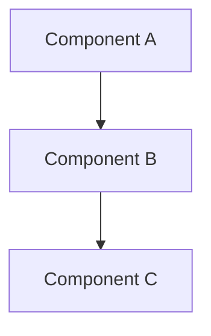

# Scaffold Manifest

Complete file manifest for bootstrapping a repository's `/docs` structure.
Each section defines a file path and its exact content.

Every directory gets exactly one `README.md`: a map of what lives there and
when to read it — not a mirror of the content.

---

## docs/README.md

**Path:** `docs/README.md`

````markdown
# Documentation

This directory is the source of truth for documentation in this repository.

## Directory Structure

```
docs/
├── README.md        # this navigation map
├── decisions/       # Architecture Decision Records
├── requirements/    # product/project requirements
├── design/          # distilled system and feature design
├── rules/           # engineering standards
├── guides/          # how-to / integration guides
├── runbooks/        # operational procedures
├── reports/         # dated, immutable point-in-time records
├── research/        # exploratory findings
├── knowledge/       # gotchas, learnings, hard-won insights
├── ai/              # AI navigation maps → source files
└── templates/       # document templates
```

## When to read what

- **Any task:** [`ai/`](./ai/) — find the right source files for a topic.
- **New feature or scope change:** [`requirements/`](./requirements/) — what we're building and why.
- **Architecture or implementation:** [`design/`](./design/) — how a subsystem works; check [`decisions/`](./decisions/) for constraints.
- **Writing code:** [`rules/`](./rules/) — the standards for the area you're touching.
- **Operating the system:** [`runbooks/`](./runbooks/).
- **Before re-discovering anything:** [`knowledge/`](./knowledge/) and [`research/`](./research/).

## Conventions

- `decisions/`, `requirements/`, and `design/` are **canonical**: sources of
  truth, progress-neutral and tracker-neutral in wording. No ticket IDs, no
  delivery status. Progress lives in the tracker; facts live here.
- Every canonical doc declares its links: a design doc names the requirements
  it satisfies and the decisions that constrain it; a decision names the
  designs it shapes. Orphan docs (nothing links to them) are a defect.
- `reports/` entries are named `YYYY-MM-DD-<topic>.md` and are **immutable**
  facts about a moment — never revised to stay current. Durable conclusions
  get distilled into `design/` or `runbooks/`.
- `decisions/` entries are named `NNNN-<slug>.md`; numbers are monotonic and
  never reused.
- Every directory has exactly one `README.md`: a map of what lives there and
  when to read it — not a mirror of the content.
- Engineers can add more files or folders as needed. This structure is a
  baseline, not a restriction.
````

---

## docs/templates/README.md

**Path:** `docs/templates/README.md`

````markdown
# Templates

Document templates for this repository's canonical docs.

## Conventions

- Copy the matching template when starting a new document: `requirements.md`
  for [`../requirements/`](../requirements/), `design.md` for
  [`../design/`](../design/), `adr.md` for [`../decisions/`](../decisions/).
- Keep templates lean; project-specific sections belong in the documents
  themselves.
````

---

## docs/templates/requirements.md

**Path:** `docs/templates/requirements.md`

````markdown
# Requirements: <topic>

**Status:** draft | active | decomposed | shipped | deprecated
**Owner:** @[handle]
**Last updated:** YYYY-MM-DD

<!-- Captures the product/business "what and why" before technical design begins. -->
<!-- The sections below are a menu, not a form: shape the doc to the product, drop what has nothing to say, and keep normative vocabulary (MUST/SHOULD/MAY) consistent once adopted. -->

## Problem

<!--
Who has the problem, what it costs them, and how they cope today.
Be specific about the user segment and the pain — vague problems produce vague solutions.
-->

## Why Now

<!-- What changed (market, technical, business) that makes this the right time to solve this. -->

## Success Criteria

<!-- Measurable outcomes. If you can't measure it, you can't know if you shipped it. -->

| Metric | Target | Measurement Method |
|---|---|---|
| [e.g. Support ticket volume for X] | [e.g. -30% within 90 days] | [e.g. Zendesk tag filter] |

## User Needs and Scenarios

<!--
Core user needs with 1-2 concrete scenarios each.
Scenarios ground abstract needs in real usage — skip formal user-story syntax.
-->

### [Need]

<!-- What the user needs and why it matters. -->

**Scenario:** [Concrete example of a user encountering this need and the expected outcome.]

## Scope

### In Scope

- [What this requirements doc covers]

### Out of Scope

- [What is excluded] — [rationale]

## Risks and Assumptions (Optional)

### Risks

<!-- Product-level risks, not technical architecture risks (those belong in design). -->

| Risk | Likelihood | Impact | Why It Exists | Mitigation |
|---|---|---|---|---|
| [e.g. Low adoption due to workflow change] | medium | high | Requires behavior change from existing users | Gradual rollout with onboarding flow |

### Assumptions

<!-- State assumptions explicitly. Each should answer: what breaks if this is wrong? -->

- [Assumption] — [what breaks if wrong]

## Constraints (Optional)

<!-- Business, regulatory, or timeline givens that are not open for debate. -->

- [Constraint] — [how it shapes the product]

## Open Points (Optional)

<!-- Unresolved product decisions. Move to relevant sections when resolved. -->

- [Question] — context and options being considered

## Related Documents (Optional)

- [Codebase Docs](../ai/) — AI-navigable map of the repo

### Downstream Design

<!-- Design docs that implement parts of this requirements doc. Update as they are created. -->

- [Design name](../design/<topic>.md) — what it covers

## Links

- Design: [docs/design/<topic>.md](../design/) — how this is built (add when it exists)
- Decisions: constraints from [docs/decisions/](../decisions/) that shape scope
````

---

## docs/templates/design.md

**Path:** `docs/templates/design.md`

````markdown
# Design: <topic>

**Status:** draft | active | shipped | deprecated
**Owner:** @[handle]
**Last updated:** YYYY-MM-DD
**Scope:** System-wide or feature-level — state which

<!-- Captures the technical "how" as a spec: approach, mechanism, and guarantees, independent of the implementing language/framework; architecture, components, cross-cutting concerns, or feature-level detail. -->
<!-- The sections below are a menu, not a form: shape the doc to the system and drop what has nothing to say. -->

## Mission

<!-- What the system or feature does, who it serves, why it exists. -->

## Design Principles

<!-- Opinionated principles that break ties between valid approaches. Not generic truisms. -->

- [Principle] — [why it matters for this system]

## Tech Stack

| Layer | Technology | Notes |
|---|---|---|
| Runtime | [e.g. Node.js 20] | [version or constraints] |
| Language | [e.g. TypeScript] | [strictness, conventions] |
| Data | [e.g. PostgreSQL 16] | [primary use case] |
| Infra | [e.g. Docker, Railway] | [deployment context] |

## Architecture

<!-- Components, boundaries, and how they communicate. -->



### [Component Name]

<!-- What it owns, exposes, and depends on. -->

## External Dependencies

<!-- Third-party services and APIs: purpose and failure behavior. -->

- [Service/API] — [purpose and failure behavior]

## Acceptance Criteria (Feature-Level Docs Only)

<!-- Functional and non-functional requirements for this feature. Each can be a one-liner or expanded with context, edge cases, and acceptance criteria — include acceptance criteria when the "done" definition isn't obvious from the requirement itself. -->

- [Requirement] — [acceptance criteria]

## Cross-Cutting Concerns

### Security

<!-- What the system trusts, where it is exposed, what gaps exist, what the plan is. -->

#### Assumptions

- [Assumption] — [what breaks if wrong]

#### Known Gaps and Risks

| Gap | Severity | Impact | Root Cause | Mitigation / Acceptance |
|---|---|---|---|---|
| [e.g. No rate limiting on public API] | high | DoS risk on auth service | Not yet implemented | Planned for v1.1; WAF provides partial coverage |

#### Controls

- [Control] — [what it protects and how]

### Data Architecture (Optional)

### Observability (Optional)

### Performance and Scalability (Optional)

### Error Handling and Resilience (Optional)

## Constraints

<!-- Givens that shape the architecture. -->

- [Constraint] — [how it shapes the architecture]

## Architecture Rationale (Optional)

<!-- Why the system is shaped this way. Connects decisions into a narrative. -->

## Open Points (Optional)

<!-- Unresolved design decisions. -->

- [Question] — context and options being considered

## Related Documents (Optional)

- [Codebase Docs](../ai/) — AI-navigable map of the repo
- [Rules](../rules/README.md) — engineering standards

## Links

- Requirements: [docs/requirements/<topic>.md](../requirements/) — what this design satisfies
- Decisions: [docs/decisions/](../decisions/) — recorded constraints this design honors
````

---

## docs/templates/adr.md

**Path:** `docs/templates/adr.md`

````markdown
# NNNN — [short title]

- **Status**: Proposed | Accepted | Superseded by NNNN
- **Date**: YYYY-MM-DD

## Context

<!-- The forces at play: the problem, constraint, or ambiguity that two reasonable people could resolve differently. -->

## Decision

<!-- The choice, in one or two sentences. Active voice: "We do X." -->

## Alternatives Considered (Optional)

- [Option] — benefits, drawbacks, and rejection reason

## Consequences

<!-- What becomes easier, what becomes harder, what we're now committed to, and what we explicitly chose not to do. -->

## Links

- Designs: [docs/design/<topic>.md](../design/) — designs this decision constrains
````

---

## docs/decisions/README.md

**Path:** `docs/decisions/README.md`

````markdown
# Decisions

Architecture Decision Records: the choices that shape this system, with the
context and consequences that make them reviewable later.

## Conventions

- Name entries `NNNN-<slug>.md`; numbers are monotonic and never reused.
- Record a decision that shapes system structure, crosses a component
  boundary, or is costly to reverse — before the code that depends on it.
  Implementation details and library picks are not decisions; they belong in
  [`../design/`](../design/) or the change itself.
- Start from [`../templates/adr.md`](../templates/adr.md).
- Status moves `Proposed → Accepted → (Superseded by NNNN)`. Never delete a
  superseded record — mark it and link forward; keep this index's one-liners
  current.
- Progress-neutral and tracker-neutral wording: no ticket IDs, no delivery
  status.
- Declare links: name the upstream docs this satisfies and the downstream docs
  it constrains.
- Update an entry in place while the decision holds; when the choice itself
  changes, add a new entry that supersedes it.

## When to read

Before proposing an architecture change — to find the constraint you are about
to break.
````

---

## docs/requirements/README.md

**Path:** `docs/requirements/README.md`

````markdown
# Requirements

Product and project requirements: the problem, who has it, the success
criteria, and the scope boundaries the system is built against.

## Conventions

- One file per product area or feature: `<topic>.md`.
- Start from [`../templates/requirements.md`](../templates/requirements.md).
- Progress-neutral and tracker-neutral wording: no ticket IDs, no delivery
  status.
- Declare links: name the upstream docs this satisfies and the downstream docs
  it constrains.
- State what must be true and why, not how to build it — the how lives in
  [`../design/`](../design/).

## When to read

Before starting a feature or changing scope — to confirm what the work has to
achieve.
````

---

## docs/design/README.md

**Path:** `docs/design/README.md`

````markdown
# Design

Distilled system and feature design: how a subsystem works and why it is
shaped that way.

## Conventions

- One file per subsystem or feature: `<topic>.md`; system-wide design lives in
  `system.md`.
- Start from [`../templates/design.md`](../templates/design.md).
- Progress-neutral and tracker-neutral wording: no ticket IDs, no delivery
  status.
- Declare links: name the upstream docs this satisfies and the downstream docs
  it constrains.
- Distilled, not raw: a design doc is the curated source of truth, not a
  transcript of the exploration behind it.

## When to read

Before implementing or changing a subsystem — and read
[`../decisions/`](../decisions/) for the constraints it must honor.
````

---

## docs/rules/README.md

**Path:** `docs/rules/README.md`

The `## Topics` table below starts empty: `cmk:agent-instructions` adds a row
when it seeds a topic, and `cmk:rule` keeps the index current afterward.

````markdown
# Rules

Engineering standards: the conventions code in this repository is expected to
follow.

## Conventions

- Shared, language-agnostic standards live in [`common/`](./common/).
- Language and framework standards live in `rules/<language>/` and
  `rules/<framework>/`; add a folder only when it is actively used.
- One topic per file, `kebab-case`, written as actionable rules rather than
  advice.
- A narrower rule overrides a broader one; say so explicitly where it does.

## Topics

| Topic | File |
|---|---|

## When to read

Before writing or reviewing code — start with `common/`, then the language or
framework folder that applies.
````

---

## docs/rules/common/README.md

**Path:** `docs/rules/common/README.md`

````markdown
# Common Rules

Language-agnostic engineering standards: the defaults that apply everywhere in
this repository.

## Conventions

- One topic per file: `<rule-topic>.md` (for example `coding-style.md`,
  `testing.md`, `git-workflow.md`).
- Keep guidance broadly applicable; anything language- or framework-specific
  belongs in a sibling folder under [`../`](../).
- These files state the current standard, not its history — update the rule
  when the convention changes.

## When to read

Before any implementation task, as the baseline no narrower rule overrides.
````

---

## docs/guides/README.md

**Path:** `docs/guides/README.md`

````markdown
# Guides

How-to and integration guides: task-oriented walkthroughs for doing a specific
thing in this repository.

## Conventions

- One file per task: `<guide-name>.md` in `kebab-case` (for example
  `local-dev.md`, `adding-a-feature.md`).
- Give prerequisites, ordered steps, and the expected outcome; verify every
  command before publishing it.
- A guide covers how to do something. How the system works belongs in
  [`../design/`](../design/); how to operate it belongs in
  [`../runbooks/`](../runbooks/).

## When to read

When you know what you need to do and want the established way to do it.
````

---

## docs/runbooks/README.md

**Path:** `docs/runbooks/README.md`

````markdown
# Runbooks

Operational procedures: the steps for running, deploying, and recovering the
system.

## Conventions

- One file per procedure: `<procedure>.md` (for example `deploy.md`,
  `rollback.md`, `incident-response.md`).
- Every step states its expected result and its rollback path.
- Write for someone under time pressure who has read nothing else.

## When to read

While operating the system — deploying, rolling back, or responding to an
incident.
````

---

## docs/reports/README.md

**Path:** `docs/reports/README.md`

````markdown
# Reports

Dated, immutable point-in-time records: what a specific run, gate, or proof
actually produced, on a specific date, with the evidence.

## Conventions

- Name entries `YYYY-MM-DD-<topic>.md`.
- A report is never revised to stay current — it is a fact about a moment.
- Durable conclusions get distilled into [`../design/`](../design/) or
  [`../runbooks/`](../runbooks/).

## When to read

Before re-running an experiment or gate someone may already have run.
````

---

## docs/research/README.md

**Path:** `docs/research/README.md`

````markdown
# Research

Exploratory findings: investigations into options, prior art, and open
questions, kept for the reasoning as much as the answer.

## Conventions

- One file per investigation: `<question>.md`, named for the question it
  explored.
- Record what was examined, what was found, and what is still unknown.
- Research is an input, not a source of truth — conclusions that hold get
  distilled into [`../design/`](../design/) or
  [`../decisions/`](../decisions/).

## When to read

Before investigating a question someone may already have explored.
````

---

## docs/knowledge/README.md

**Path:** `docs/knowledge/README.md`

````markdown
# Knowledge

Gotchas, learnings, and hard-won insights: the non-obvious facts that cost
someone time to discover.

## Conventions

- One file per topic in `kebab-case`, named by domain rather than by date or
  session (for example `infrastructure.md`, `api-quirks.md`).
- Entries accumulate inside the file, newest first.
- Promote an entry to [`../rules/`](../rules/) once it becomes an expected
  standard.

## When to read

Before debugging something unfamiliar — and before re-discovering anything.
````

---

## docs/ai/README.md

**Path:** `docs/ai/README.md`

````markdown
# AI Navigation

Maps from topic to source file: short what/where docs that point an agent at
the right code instead of restating it.

## Conventions

- Mirror the shape of the codebase: one folder per area, each with its own
  `README.md` index.
- Name paths and packages; point at code rather than duplicating it. No ticket
  IDs, no delivery status.
- Update the affected map in the same change that moves or renames the code it
  describes.

## When to read

First, on any task — to find which source files a topic lives in.
````
